title: "Εξόρυξη Δεδομένων για την Ανάλυση και Πρόβλεψη Κατανάλωσης Ενέργειας σε Έξυπνο Σπίτι"
author:
  - "Κωνσταντίνος Παπαδόγιαννης (2022141)"
  - "Anastasiia Zervas (it2022119)"
date: "Ιανουάριος 2026"
---

# Εξόρυξη Δεδομένων για την Ανάλυση και Πρόβλεψη Κατανάλωσης Ενέργειας σε Έξυπνο Σπίτι

---

**Μάθημα:** Εξόρυξη Δεδομένων  
**Πανεπιστήμιο:** Χαροκόπειο Πανεπιστήμιο

---

**Φοιτητές**

Κωνσταντίνος Παπαδόγιαννης (2022141)  
Anastasiia Zervas (it2022119)

**Ημερομηνία**  
Ιανουάριος 2026

## 1. Στόχος ενότητας

Σε αυτή την ενότητα περιγράφουμε συνοπτικά τα βήματα προεπεξεργασίας που εφαρμόσαμε στα δεδομένα κατανάλωσης ενέργειας νοικοκυριού, ώστε:

- να εξασφαλίσουμε καθαρά και συνεπή δεδομένα,
- να οργανώσουμε σωστά τη χρονική πληροφορία,
- να δημιουργήσουμε ένα αξιόπιστο ημερήσιο dataset για τα επόμενα μοντέλα ταξινόμησης, παλινδρόμησης, clustering και κανόνων συσχέτισης.

Η έμφαση δίνεται στην ποιότητα δεδομένων και στην αποφυγή data leakage.

## 2. Περιγραφή αρχικού συνόλου δεδομένων

- Πηγή: δημόσιο dataset «Individual household electric power consumption».
- Επίπεδο λεπτομέρειας: μετρήσεις ανά λεπτό για περίπου 4 χρόνια.
- Βασικές μεταβλητές:
  - Global_active_power (kW), Global_intensity (A), Voltage (V),
  - Sub_metering_1, Sub_metering_2, Sub_metering_3 (Wh ανά λεπτό),
  - Date, Time.

Αρχικά εντοπίσαμε ελλιπείς τιμές ("?") και τις μετατρέψαμε σε NaN κατά τη φόρτωση.

## 3. Βήματα προεπεξεργασίας

### 1. Δημιουργία χρονικής σήμανσης (Datetime)

- Ενοποιήσαμε τις στήλες `Date` και `Time` σε νέα στήλη `Datetime` με σωστό format (ημέρα/μήνας/έτος και ώρα).
- Μετατρέψαμε τη νέα στήλη σε τύπο datetime, ελέγχοντας για μη έγκυρες τιμές.
- Ταξινομήσαμε τον πίνακα χρονικά και ορίσαμε τη `Datetime` ως ευρετήριο, ώστε να μπορούμε να κάνουμε χρονοσειριακή ανάλυση.

### 2. Δημιουργία ημερήσιου πίνακα κατανάλωσης (df_daily)

Για κάθε ημέρα υπολογίσαμε:

- **n_measurements**: πλήθος διαθέσιμων μετρήσεων,
- **missing_minutes** και **missing_ratio**: πόσα λεπτά λείπουν και ποιο είναι το ποσοστό τους,
- **daily_total_active_energy_kwh**: συνολική ενεργός ενέργεια σε kWh (άθροισμα ισχύος ανά λεπτό / 60),
- **daily_mean_voltage**, **daily_mean_intensity**: ημερήσιοι μέσοι όροι τάσης και έντασης,
- **daily_sub1_wh**, **daily_sub2_wh**, **daily_sub3_wh**: ημερήσια αθροίσματα των τριών υπομετρητών.

Έτσι δημιουργήσαμε έναν πρώτο ημερήσιο πίνακα `df_daily` που συμπυκνώνει τις λεπτομερείς μετρήσεις.

### 3. Κανόνας ποιότητας ημερών (df_daily_clean)

Για να αποφύγουμε την εκπαίδευση μοντέλων σε «χαλασμένες» ημέρες με πολλά κενά δεδομένων, ορίσαμε σαφή κανόνα ποιότητας:

- Κρατάμε μόνο τις ημέρες με **missing_ratio ≤ 0.1** (δηλαδή μέχρι 10% ελλιπή λεπτά).
- Απορρίπτουμε τις υπόλοιπες ημέρες από τα σύνολα που θα χρησιμοποιηθούν για μοντέλα.

Εφαρμόζοντας τον κανόνα στον `df_daily` προέκυψε ο καθαρός ημερήσιος πίνακας `df_daily_clean`:

- Συνολικές ημέρες: 1442
- Ημέρες που κρατήθηκαν: 1418
- Ημέρες που απορρίφθηκαν: 24 (≈1.7%)

Στο `df_daily_clean` η ημερήσια συνολική ενέργεια κινείται σε ρεαλιστικά επίπεδα (περίπου 4–80 kWh) και το missing_ratio είναι πρακτικά μηδενικό.

### 4. Πρόσθετα ημερήσια χαρακτηριστικά (features)

Πάνω στο `df_daily_clean` προσθέσαμε επιπλέον χαρακτηριστικά ώστε το ημερήσιο dataset να είναι πιο πλούσιο για τα επόμενα μοντέλα:

- **peak_hour_power_kw**: μέγιστη ωριαία μέση ενεργός ισχύς κάθε ημέρας,
- **nighttime_energy_kwh**: ενέργεια σε kWh που καταναλώνεται 00:00–06:00,
- **day_of_week**, **month**, **season**: ημέρα εβδομάδας, μήνας και εποχή,
- **is_weekend**, **is_workday**: δυαδικές ενδείξεις για Σαββατοκύριακο / εργάσιμη ημέρα,
- **rolling_7d_mean_kwh**: κυλιόμενος μέσος όρος 7 τελευταίων ημερών της ημερήσιας κατανάλωσης.

Όλα αυτά τα features βασίζονται μόνο στην ίδια ή σε προηγούμενες ημέρες, ώστε να μην δημιουργείται data leakage για μοντέλα που θα προβλέπουν επόμενες ημέρες.

## 4. Οπτικοποιήσεις προεπεξεργασίας

Οι βασικές οπτικοποιήσεις που χρησιμοποιήσαμε για να ελέγξουμε την ποιότητα και τη ρεαλιστικότητα των δεδομένων είναι οι εξής.

### 1. Κατανομές βασικών μεγεθών κατανάλωσης

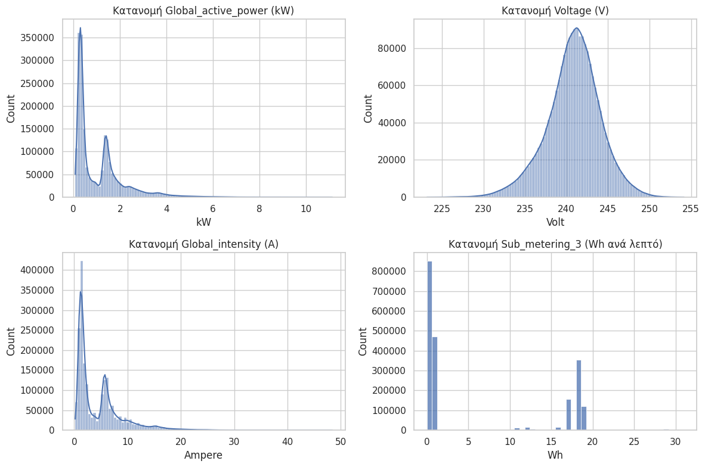

Το σχήμα αυτό δείχνει:

- την κατανομή της Global_active_power,
- την κατανομή της τάσης Voltage,
- την κατανομή της Global_intensity,
- την κατανομή του Sub_metering_3.

Από τις κατανομές επιβεβαιώσαμε ότι:

- η κατανάλωση είναι κυρίως σε χαμηλά–μεσαία επίπεδα, με λίγες κορυφές υψηλής ισχύος,
- η τάση συγκεντρώνεται γύρω από φυσιολογικές τιμές οικιακού δικτύου,
- ο υπομετρητής 3 είναι ενεργός μόνο σε συγκεκριμένα διαστήματα (συμπεριφορά ταιριαστή με συσκευές υψηλής κατανάλωσης).

### 2. Κατανομή ημερήσιας ενέργειας και missing_ratio

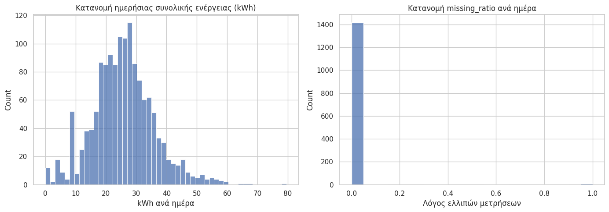

Εδώ βλέπουμε δύο ιστογράμματα:

- την κατανομή της ημερήσιας συνολικής ενέργειας σε kWh,
- την κατανομή του missing_ratio ανά ημέρα.

Αυτές οι οπτικοποιήσεις μας βοήθησαν:

- να επιβεβαιώσουμε ότι οι ημερήσιες τιμές κατανάλωσης είναι ρεαλιστικές για ένα νοικοκυριό,
- να διαπιστώσουμε ότι οι περισσότερες ημέρες έχουν πλήρη δεδομένα και μόνο λίγες έχουν σημαντικά κενά, κάτι που δικαιολογεί τον κανόνα ποιότητας missing_ratio ≤ 0.1.

## 5. Ταξινόμηση ημερών σε υψηλή / κανονική κατανάλωση

Σε επόμενο βήμα χρησιμοποιήσαμε το ημερήσιο, καθαρό dataset `df_daily_clean` για να λύσουμε ένα απλό αλλά χρήσιμο πρόβλημα ταξινόμησης: να προβλέψουμε αν μια μέρα είναι **υψηλής** ή **κανονικής** κατανάλωσης.

Η ιδέα είναι να συγκρίνουμε την ημερήσια κατανάλωση με τον **μέσο όρο** του νοικοκυριού (όπως ζητά και η εκφώνηση) και να ορίσουμε μια δυαδική μεταβλητή στόχο `is_high_consumption` (1 = υψηλή, 0 = κανονική). Για να αποφύγουμε διαρροή πληροφορίας, ο τελικός κανόνας ορίστηκε με βάση τον μέσο όρο **μόνο στο training set**, και στη συνέχεια εφαρμόστηκε αυτούσιος στα validation και test sets.

### 5.1 Επιλογή ορίου (threshold) και έλεγχος κλάσεων

Στο παρακάτω διάγραμμα βλέπουμε την κατανομή της ημερήσιας συνολικής κατανάλωσης και διάφορα υποψήφια thresholds (μέσος όρος, 75ο, 80ό και 90ό ποσοστημόριο), ώστε να ελέγξουμε πόσες ημέρες χαρακτηρίζονται ως «υψηλής κατανάλωσης» σε κάθε σενάριο:

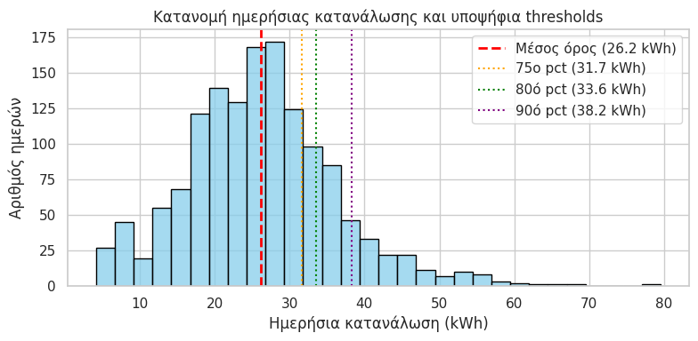

Τελικά κρατήσαμε τον **μέσο όρο** ως όριο, γιατί είναι πιο κοντά στο πνεύμα της εργασίας και οδηγεί σε σχετικά ισορροπημένες κλάσεις (περίπου 50% υψηλές / 50% κανονικές μέρες), κάτι που κάνει τις μετρικές ταξινόμησης πιο ουσιαστικές.

### 5.2 Χρονικός διαχωρισμός και χαρακτηριστικά

Για να τηρήσουμε τον χρονικό χαρακτήρα των δεδομένων, κάναμε διαχωρισμό σε:

- 60% **train**, 20% **validation**, 20% **test**,

χρονικά ταξινομημένα, ώστε τα μοντέλα να «βλέπουν» μόνο το παρελθόν όταν προβλέπουν για επόμενα διαστήματα.

Ως χαρακτηριστικά (features) χρησιμοποιήσαμε απλά, κατανοητά μεγέθη, όπως:

- ημερήσιους μέσους όρους τάσης και έντασης,
- ημερήσια αθροίσματα των τριών υπομετρητών,
- peak_hour_power και nighttime_energy,
- ημερολογιακά χαρακτηριστικά (ημέρα εβδομάδας, μήνας, ένδειξη weekend / workday).

Δεν χρησιμοποιήσαμε την ίδια την ημερήσια κατανάλωση ως feature, ώστε να αποφύγουμε τεχνητή «βοήθεια» του μοντέλου.

### 5.3 Αποτελέσματα μοντέλων ταξινόμησης

Δοκιμάσαμε τρία κλασικά μοντέλα ταξινόμησης:

- **Logistic Regression** (ως βασικό, ερμηνεύσιμο μοντέλο),
- **Random Forest Classifier**,
- **Gradient Boosting Classifier**.

Για καθένα από αυτά εξετάσαμε confusion matrix και ROC curve στο validation set. Ενδεικτικά παρακάτω φαίνονται τα αντίστοιχα διαγράμματα για τα τρία μοντέλα:

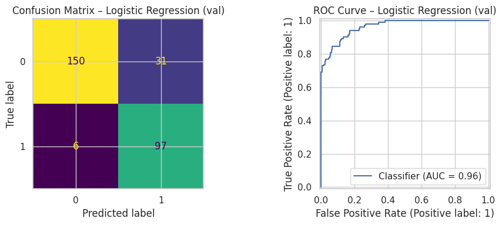

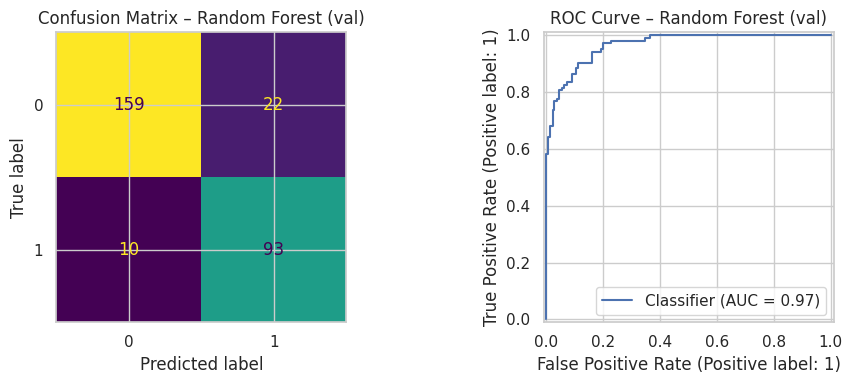

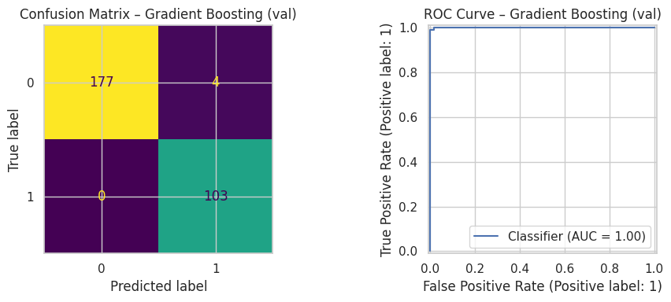

Και στα τρία μοντέλα οι μετρικές στο validation set (Accuracy, F1, ROC-AUC) είναι πολύ υψηλές, με τα δενδροειδή ensembles (Random Forest και Gradient Boosting) να υπερτερούν ελαφρώς της Logistic Regression.

### 5.4 Σύγκριση τελικής απόδοσης στο test set

Τελικά, κρατήσαμε στην άκρη το test set και το χρησιμοποιήσαμε μόνο μία φορά στο τέλος, για να κάνουμε δίκαιη σύγκριση των μοντέλων. Το επόμενο διάγραμμα συνοψίζει την απόδοση (Accuracy, F1, ROC-AUC) στο test set:

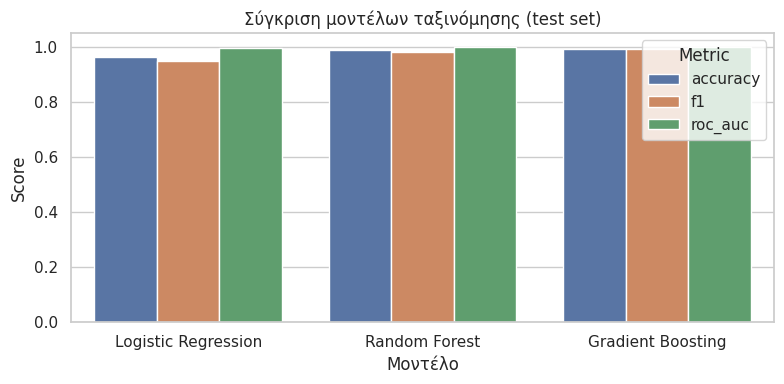

Και τα τρία μοντέλα πετυχαίνουν σχεδόν τέλεια απόδοση, κάτι που είναι λογικό αν σκεφτούμε ότι η στόχος `is_high_consumption` είναι ουσιαστικά κατώφλι της ημερήσιας κατανάλωσης και τα features είναι ισχυρά «υποκατάστατα» αυτής της πληροφορίας. Παρ’ όλα αυτά, το **Gradient Boosting Classifier** εμφανίζεται οριακά καλύτερο (ιδιαίτερα σε F1-score) και το επιλέγουμε ως **τελικό μοντέλο ταξινόμησης**, με τη Logistic Regression να παραμένει ως απλό baseline αναφοράς.

## 6. Παλινδρόμηση: Πρόβλεψη κατανάλωσης επόμενης ημέρας

Στο βήμα της παλινδρόμησης στοχεύουμε να προβλέψουμε τη **συνολική κατανάλωση ενέργειας της επόμενης ημέρας** (σε kWh), με βάση μόνο πληροφορία από την τρέχουσα και παλαιότερες ημέρες. Ορίζουμε ως συνεχή στόχο τη μεταβλητή `next_day_total_energy_kwh`, η οποία προκύπτει ως μετατόπιση μίας ημέρας προς τα πίσω της `daily_total_active_energy_kwh`. Η συσχέτισή της με την κατανάλωση της σημερινής ημέρας είναι μεσαία–υψηλή (περίπου 0.61), κάτι που δείχνει ότι υπάρχει μεν προβλεψιμότητα, αλλά και σημαντικός θόρυβος (ρεαλιστικό για πραγματικά δεδομένα).

Για να αποφύγουμε διαρροή πληροφορίας, κρατήσαμε αυστηρά χρονολογική σειρά και κάναμε split 60% **train**, 20% **validation**, 20% **test**. Ακολουθήσαμε την ίδια λογική με την ταξινόμηση: όλα τα hyperparameters επιλέγονται με βάση το train/validation, ενώ το test set χρησιμοποιείται μόνο μία φορά στο τέλος, για την τελική αξιολόγηση.

### 6.1 Κατανομή στόχου και έλεγχος split

Στο παρακάτω σχήμα φαίνεται η κατανομή του στόχου `next_day_total_energy_kwh` συνολικά, καθώς και οι μέσες τιμές του στις τρεις υποπεριόδους (train, validation, test):

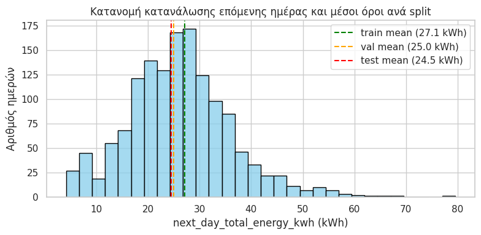

Οι κατανομές και οι μέσες τιμές στις τρεις περιόδους είναι πολύ κοντά, γεγονός που υποδεικνύει ότι ο χρονικός διαχωρισμός δεν έχει δημιουργήσει κάποιο τεχνητό bias (π.χ. όλα τα «βαριά» χρόνια σε ένα μόνο split). Επιπλέον, ο στόχος κινείται σε ρεαλιστικά επίπεδα (περίπου 4–80 kWh, με μέσο γύρω στις 26–27 kWh), κάτι που επιβεβαιώνει ότι το ημερήσιο dataset παραμένει φυσιολογικό και μετά τον ορισμό του στόχου.

### 6.2 Naive baseline παλινδρόμησης

Ως απλό αλλά ισχυρό baseline ορίσαμε τον κανόνα:

> **Πρόβλεψη επόμενης ημέρας = συνολική κατανάλωση της σημερινής ημέρας**

Δηλαδή, για κάθε split χρησιμοποιούμε ως πρόβλεψη του στόχου `next_day_total_energy_kwh` την τιμή `daily_total_active_energy_kwh` της ίδιας ημέρας. Αυτό το baseline είναι ρεαλιστικό (πολλές μέρες διαδοχικά έχουν παρόμοια κατανάλωση) και θέτει έναν τίμιο «πήχη» για τα μοντέλα.

Στο test set το baseline πετυχαίνει περίπου:

- **MAE ≈ 4.93 kWh**
- **RMSE ≈ 6.84 kWh**
- **R² ≈ 0.21**

Δηλαδή το μέσο απόλυτο σφάλμα είναι λίγο κάτω από 5 kWh, που αντιστοιχεί περίπου στο 20% της μέσης ημερήσιας κατανάλωσης – μια καθόλου αμελητέα, αλλά όχι και καταστροφική απόδοση για τόσο απλό κανόνα.

### 6.3 Ridge Regression

Ως πρώτο «σοβαρό» μοντέλο παλινδρόμησης χρησιμοποιήσαμε **Ridge Regression** (γραμμική παλινδρόμηση με L2-regularization) σε pipeline με **StandardScaler**, ώστε όλα τα αριθμητικά χαρακτηριστικά να κλιμακωθούν σωστά. Τα χαρακτηριστικά που χρησιμοποιήθηκαν περιλαμβάνουν:

- `daily_total_active_energy_kwh` (τρέχουσα ημέρα),
- ημερήσιους μέσους όρους τάσης και έντασης,
- ημερήσια αθροίσματα των υπομετρητών,
- ενέργεια νυχτερινού διαστήματος και peak ισχύος,
- ημερολογιακές μεταβλητές (ημέρα εβδομάδας, μήνας, weekend/workday).

Το hyperparameter **α** της Ridge επιλέχθηκε με βάση το validation set, ελαχιστοποιώντας το RMSE. Στο τελικό test set, το μοντέλο πετυχαίνει περίπου:

- **MAE ≈ 4.27 kWh**
- **RMSE ≈ 5.68 kWh**
- **R² ≈ 0.46**

Στο παρακάτω διάγραμμα φαίνεται η σχέση μεταξύ πραγματικών και προβλεπόμενων τιμών στο test set (όσο πιο κοντά στη διαγώνιο y=x, τόσο καλύτερη η πρόβλεψη):

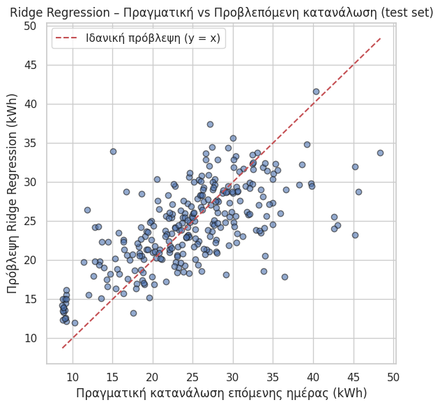

Βλέπουμε ότι το Ridge μειώνει αισθητά το σφάλμα σε σχέση με το baseline (ιδίως στο RMSE), εξηγώντας περίπου το 46% της διακύμανσης της ημερήσιας κατανάλωσης της επόμενης ημέρας.

### 6.4 RandomForestRegressor και τελική επιλογή μοντέλου

Για να αξιοποιήσουμε πιθανές μη γραμμικότητες και αλληλεπιδράσεις μεταξύ χαρακτηριστικών, εφαρμόσαμε επίσης **RandomForestRegressor**, δοκιμάζοντας διαφορετικούς συνδυασμούς υπερπαραμέτρων (`n_estimators`, `max_depth`, `min_samples_leaf`) και επιλέγοντας εκείνον με το μικρότερο RMSE στο validation set. Η τελική εκπαίδευση έγινε, όπως και στο Ridge, σε συνένωση train+validation.

Στο test set το καλύτερο RandomForestRegressor πετυχαίνει περίπου:

- **MAE ≈ 4.10 kWh**
- **RMSE ≈ 5.59 kWh**
- **R² ≈ 0.47**

Η γραφική απεικόνιση πραγματικών vs προβλεπόμενων τιμών στο test set δείχνει ελαφρώς πιο «συγκεντρωμένα» σημεία γύρω από τη διαγώνιο σε σχέση με το Ridge:

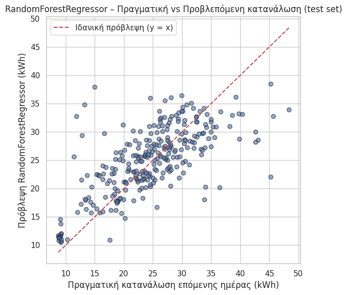

Τέλος, στο παρακάτω σχήμα συνοψίζονται οι μετρικές MAE, RMSE και R² για τα τρία μοντέλα (Naive baseline, Ridge, RandomForest) πάνω στο test set:

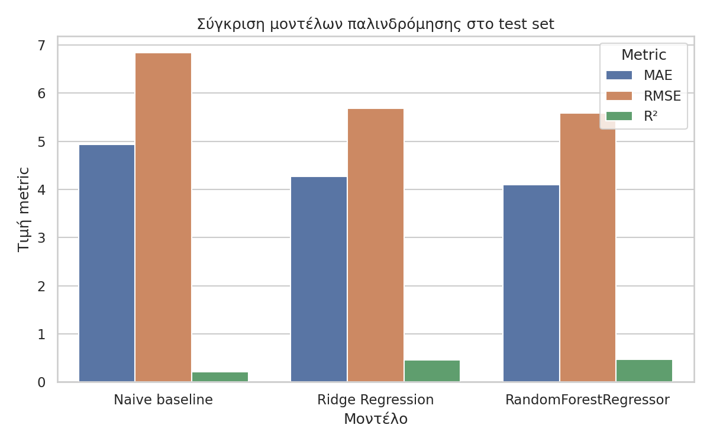

Από τη σύγκριση φαίνεται ξεκάθαρα ότι **και τα δύο μοντέλα παλινδρόμησης υπερτερούν του naive baseline**, με το RandomForestRegressor να πετυχαίνει οριακά καλύτερες τιμές (χαμηλότερα MAE/RMSE, ελαφρώς υψηλότερο R²). Παρότι τα σφάλματα της τάξης των 4–6 kWh σημαίνουν ότι δεν μπορούμε να προβλέψουμε την επόμενη ημέρα με «μαγική» ακρίβεια (π.χ. ±0.3 kWh, που θα ήταν μη ρεαλιστικό για αυτά τα δεδομένα), η σχετική βελτίωση σε σχέση με τον απλό κανόνα **«αύριο ≈ σήμερα»** είναι σημαντική και ρεαλιστική.

Συνοψίζοντας, επιλέγουμε το **RandomForestRegressor** ως **τελικό μοντέλο παλινδρόμησης** για πρόβλεψη της ημερήσιας κατανάλωσης της επόμενης ημέρας, διατηρώντας το Ridge ως γραμμικό baseline και το naive μοντέλο ως σημείο αναφοράς. Η διαδικασία σχεδιάστηκε ώστε να αποφεύγει data leakage (με αυστηρό χρονικό split και χρήση του test set μόνο στο τέλος) και να αποτυπώνει ρεαλιστική απόδοση πάνω σε πραγματικά, θορυβώδη δεδομένα.

## 7. Clustering ημερών (K-Means)

Στόχος του clustering είναι να ομαδοποιηθούν οι ημέρες σε διακριτούς «τύπους» βάσει του ημερήσιου προφίλ κατανάλωσης. Χρησιμοποιήθηκε **K-Means** πάνω σε scaled συνεχόμενα χαρακτηριστικά και αμετάβλητα δυαδικά.

### 7.1 Χαρακτηριστικά και κλιμάκωση

- Χαρακτηριστικά εισόδου (ενδεικτικά):
  - `daily_total_active_energy_kwh`, `daily_mean_voltage`, `daily_mean_intensity`,
  - `daily_sub1_wh`, `daily_sub2_wh`, `daily_sub3_wh`,
  - `peak_hour_power_kw`, `nighttime_energy_kwh`,
  - `is_weekend`, `is_workday`.
- Εφαρμόστηκε **StandardScaler** μόνο στα συνεχόμενα χαρακτηριστικά. Τα δυαδικά (`is_weekend`, `is_workday`) παρέμειναν ως 0/1.

### 7.2 Επιλογή αριθμού συστάδων (k)

- Δοκιμάστηκαν τιμές k από **2 έως 8** και υπολογίστηκαν τα metrics:
  - **Silhouette score** (όσο μεγαλύτερο, τόσο καλύτερα διαχωρισμένες συστάδες),
  - **Davies–Bouldin index** (όσο μικρότερο, τόσο καλύτερα διαχωρισμένες συστάδες).
- Το διάγραμμα της επιλογής k αποθηκεύτηκε και περιλαμβάνεται εδώ:

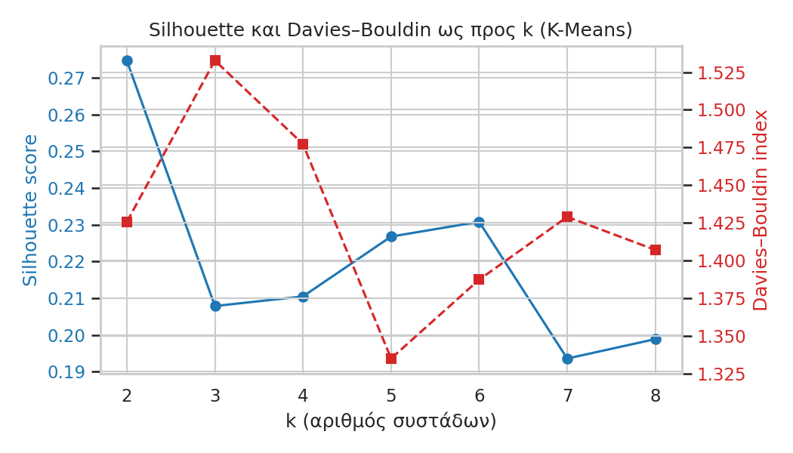

- Παρατηρήσεις από τα metrics:
  - k=2: υψηλότερο Silhouette (~0.275), αλλά μέτριο DB (~1.43).
  - k=5: καλό Silhouette (~0.227, δεύτερο καλύτερο) και **καλύτερο** DB (~1.335).
- Επιλογή: **k = 5** ως ρεαλιστικός συμβιβασμός μεταξύ διαχωρισιμότητας και ερμηνευσιμότητας (καθημερινές vs Σ/Κ και επίπεδα κατανάλωσης).

### 7.3 Τελικό μοντέλο K-Means (k=5)

- Ποιότητα συστάδων (τελικά metrics):
  - **Silhouette score ≈ 0.227**
  - **Davies–Bouldin index ≈ 1.335**
- Κατανομή ημερών ανά συστάδα: ισορροπημένη, με δύο κυρίως weekday clusters και 2–3 συστάδες με αυξημένο ποσοστό Σ/Κ.
- Ποσοστό ημερών Σ/Κ ανά συστάδα (ενδεικτικά):
  - Cluster 1: ~24%
  - Cluster 0: ~18%
  - Cluster 4: ~17%
  - Cluster 3: ~54%
  - Cluster 2: ~67%

### 7.4 Προφίλ συστάδων και οπτικοποίηση

- Μέση ημερήσια κατανάλωση ανά συστάδα (kWh):
  - Cluster 0: ~20.50 kWh (μεσαίες καθημερινές)
  - Cluster 1: ~14.41 kWh (χαμηλές καθημερινές)
  - Cluster 2: ~45.14 kWh (πολύ υψηλές, αυξημένη `nighttime_energy_kwh` και Σ/Κ)
  - Cluster 3: ~36.79 kWh (υψηλές/πολύ υψηλές, συχνά Σ/Κ)
  - Cluster 4: ~26.37 kWh (μεσαίες/υψηλές με έμφαση σε `sub3`)

Η συνοπτική οπτικοποίηση των προφίλ (μέση kWh και ποσοστό Σ/Κ ανά συστάδα) αποθηκεύτηκε και παρατίθεται:

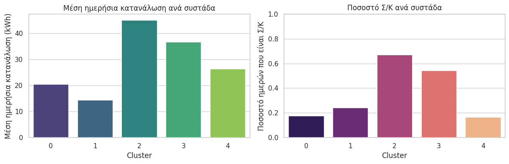

#### 7.4.1 Κατανομή ημερών ανά συστάδα

Για πληρότητα, παρατίθεται και η κατανομή των ημερών ανά συστάδα (barplot):

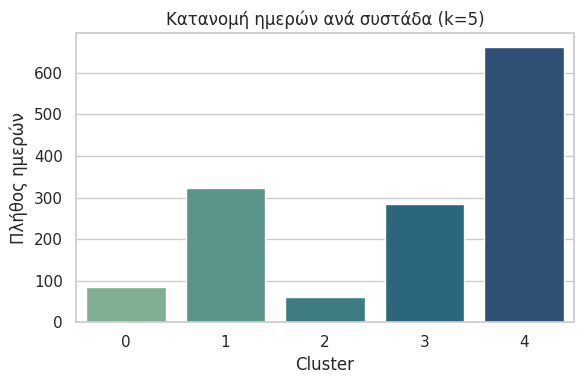

Το διάγραμμα δείχνει ισορροπημένη κατανομή με δύο clusters κυρίως καθημερινών και 2–3 συστάδες με αυξημένη παρουσία Σ/Κ (όπως φαίνεται και από τα ποσοστά Σ/Κ που παρατέθηκαν παραπάνω).

#### 7.4.2 Πίνακας στατιστικών ανά συστάδα

| Cluster | Πλήθος | Ποσοστό | Μέση kWh | Νυχτερινή kWh | Sub1 Wh | Sub2 Wh | Sub3 Wh | Ποσοστό Σ/Κ |
|---------|--------:|--------:|---------:|--------------:|--------:|--------:|--------:|------------:|
| 0 | 85 | 6.00% | 20.50 | 2.31 | 1669.52 | 1712.11 | 7246.62 | 17.60% |
| 1 | 324 | 22.80% | 14.41 | 2.47 | 501.25 | 887.07 | 5204.18 | 24.40% |
| 2 | 61 | 4.30% | 45.14 | 10.99 | 2504.67 | 3015.80 | 10973.87 | 67.20% |
| 3 | 285 | 20.10% | 36.79 | 2.84 | 3164.56 | 4229.21 | 11933.89 | 54.40% |
| 4 | 663 | 46.80% | 26.37 | 2.73 | 1402.29 | 1245.50 | 10279.48 | 16.70% |

Σχόλιο: Οι τιμές αντιστοιχούν σε μέσους όρους ανά συστάδα. Τα ποσοστά είναι ως προς το σύνολο ημερών του `df_daily_clean`.

### 7.5 Συμπέρασμα

Οι συστάδες που προέκυψαν είναι ερμηνεύσιμες και συμβατές με την εκφώνηση: ξεχωρίζουν **χαμηλές/μεσαίες καθημερινές**, **βαριές Σ/Κ** και **ανώμαλες/πολύ υψηλής κατανάλωσης μέρες**. Τα metrics (Silhouette ≈ 0.23, DB ≈ 1.34) είναι σε ρεαλιστικά επίπεδα για πραγματικά δεδομένα νοικοκυριού και επιβεβαιώνουν ότι ο διαχωρισμός είναι ωφέλιμος για περιγραφική ανάλυση και μεταγενέστερη στόχευση (π.χ. κανόνες συσχέτισης).

## 8. Κανόνες Συσχέτισης (Association Rules)

Σκοπός του βήματος είναι η ανάδειξη **ερμηνεύσιμων σχέσεων** μεταξύ ημερήσιων χαρακτηριστικών κατανάλωσης, με χρήση **FP-Growth** για εύρεση συχνών συνόλων και παραγωγή κανόνων με μετρικές **Support**, **Confidence** και **Lift**.

### 8.1 Μεθοδολογία και μετασχηματισμοί

- **Διακριτοποίηση** συνεχών χαρακτηριστικών σε κατηγορίες **Low / Med / High**: `sub1`, `sub2`, `sub3`, `night` (00:00–06:00), `peak` (μέγιστη ωριαία ισχύς), `total` (ημερήσια συνολική kWh).
- **Δυαδικές ενδείξεις**: `is_weekend`, `is_workday` (χωρίς κλιμάκωση).
- **Συναλλαγές (baskets)**: δημιουργία one-hot transactions με **μοναδικά, σαφή prefixes** (π.χ. `sub3_high`, `peak_low`, `total_high`).

### 8.2 Παράμετροι και βασικοί αριθμοί

- **Σύνολο συναλλαγών (ημέρες)**: 1418
- **Διακριτά items**: 20
- **FP-Growth min_support**: 0.08
- **Association Rules min_confidence**: 0.60
- **Συχνά σύνολα (frequent itemsets)**: 258
- **Κανόνες (rules)**: 184
- **Κανόνες με RHS → `total_high`**: 19

Τα αναλυτικά αποτελέσματα έχουν αποθηκευτεί:

- [results/association_transactions_preview.csv](../results/association_transactions_preview.csv)
- [results/association_rules_all.csv](../results/association_rules_all.csv)
- [results/association_rules_total_high.csv](../results/association_rules_total_high.csv)

### 8.3 Αντιπροσωπευτικοί κανόνες

- `peak_low` ∧ `sub3_low` → `total_low`: **support** ≈ 0.183, **confidence** ≈ 0.949, **lift** ≈ 2.844
- `peak_high` ∧ `sub3_high` → `total_high`: **support** ≈ 0.157, **confidence** ≈ 0.937, **lift** ≈ 2.809
- `sub2_high` ∧ `sub3_high` → `total_high`: **support** ≈ 0.132, **confidence** ≈ 0.899, **lift** ≈ 2.695
- `is_weekend` ∧ `total_high` → `peak_high`: **support** ≈ 0.119, **confidence** ≈ 0.880, **lift** ≈ 2.639

Σχόλιο: Οι κανόνες είναι **ρεαλιστικοί** και ευθυγραμμίζονται με τη συμπεριφορά του νοικοκυριού (π.χ. υψηλές τιμές `sub3` και `peak` συνοδεύονται από υψηλή ημερήσια κατανάλωση).

### 8.4 Οπτικοποιήσεις (σε σωστή λογική σειρά)

1. **Top-10 κανόνες με το μεγαλύτερο Lift** (overview των ισχυρότερων συσχετίσεων):

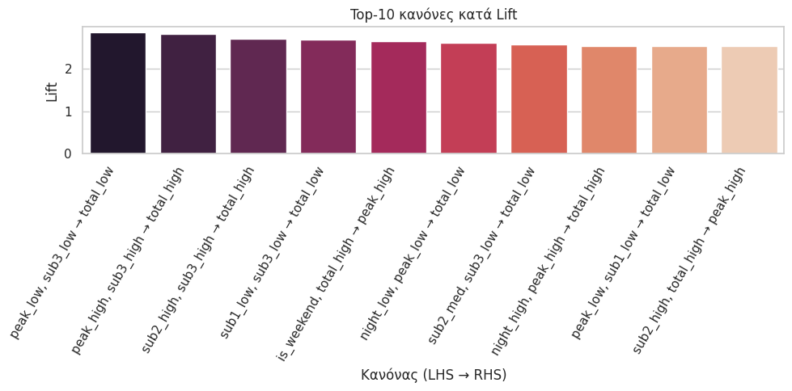

2. **Διάγραμμα Support vs Confidence (χρώμα = Lift)** (χάρτης ποιότητας κανόνων):

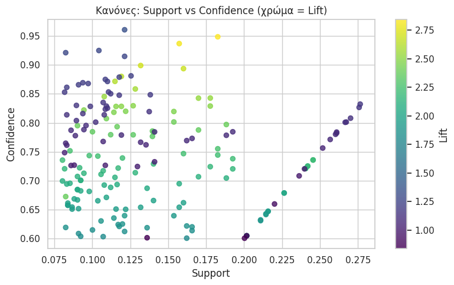

3. **Συχνότητα στοιχείων στην LHS για κανόνες με RHS → `total_high`** (ποιοι όροι εμφανίζονται συχνότερα στη «σκανδάλη» υψηλής ημερήσιας κατανάλωσης):

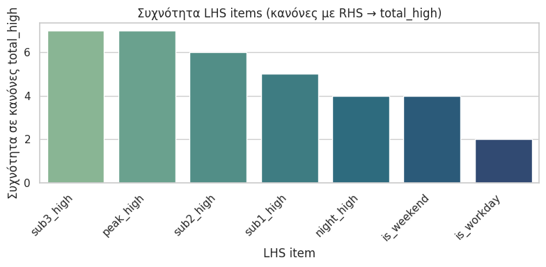

### 8.5 Συμπέρασμα

Η ανάλυση Association Rules προσφέρει **ερμηνεύσιμη γνώση** για μοτίβα κατανάλωσης: οι συνδυασμοί υψηλών τιμών στα υπομετρητές (`sub2`, `sub3`) και στην αιχμή ισχύος (`peak`) συσχετίζονται έντονα με **υψηλή ημερήσια κατανάλωση** (`total_high`). Τα thresholds (support=0.08, confidence=0.60) εξασφαλίζουν ότι οι κανόνες είναι **επαρκώς συχνοί** και **αξιόπιστοι**. Οι οπτικοποιήσεις βοηθούν να εντοπιστούν οι ισχυρότεροι κανόνες (με υψηλό lift) και οι πιο συχνοί LHS όροι για στοχευμένες παρεμβάσεις/συστάσεις.

## 9. Πρόβλεψη Χρονοσειρών (Προαιρετικό Βήμα)

Στο προαιρετικό βήμα εφαρμόσαμε **πρόβλεψη χρονοσειρών** για την ημερήσια κατανάλωση ενέργειας (one-step ahead prediction), συγκρίνοντας τέσσερα διαφορετικά μοντέλα: **Baseline (Persistence)**, **ARIMA**, **Prophet** και **LSTM**. Στόχος ήταν να προβλέψουμε την ημερήσια κατανάλωση της επόμενης ημέρας με βάση μόνο το ιστορικό των προηγούμενων ημερών.

### 9.1 Μεθοδολογία και χρονικό split

- **Dataset**: `df_daily_clean` με 1418 ημέρες (2006-12-17 έως 2010-11-25)
- **Στόχος**: `daily_total_active_energy_kwh` (ημερήσια συνολική ενέργεια σε kWh)
- **Χρονικό split** (αυστηρά διατηρώντας τη χρονική σειρά):
  - **Train**: 60% (850 ημέρες, 2006-12-17 → 2009-04-17)
  - **Validation**: 20% (283 ημέρες, 2009-04-18 → 2010-02-01)
  - **Test**: 20% (285 ημέρες, 2010-02-02 → 2010-11-25)
- **Μετρικές αξιολόγησης**: RMSE (Root Mean Square Error) και MAPE (Mean Absolute Percentage Error)

Η διαδικασία σχεδιάστηκε ώστε να αποφύγουμε **data leakage**:
- Κάθε μοντέλο εκπαιδεύεται πρώτα μόνο στο train set και αξιολογείται στο validation.
- Στη συνέχεια, για το τελικό test, το μοντέλο επανεκπαιδεύεται στο train+validation και αξιολογείται μόνο στο test.
- Το test set χρησιμοποιείται **μόνο μία φορά** για τελική σύγκριση.

### 9.2 Baseline: Persistence Model

Το απλούστερο μοντέλο αναφοράς (baseline) είναι η **εμμονή (persistence)**: η πρόβλεψη για την επόμενη ημέρα είναι ίση με την κατανάλωση της τρέχουσας ημέρας (ŷ_{t+1} = y_t).

**Αποτελέσματα Baseline:**
- **Validation**: RMSE = 7.30 kWh, MAPE = 23.51%
- **Test**: RMSE = 6.84 kWh, MAPE = 20.31%

Το baseline αποδεικνύεται αρκετά ισχυρό, καθώς οι διαδοχικές ημέρες συχνά έχουν παρόμοια κατανάλωση.

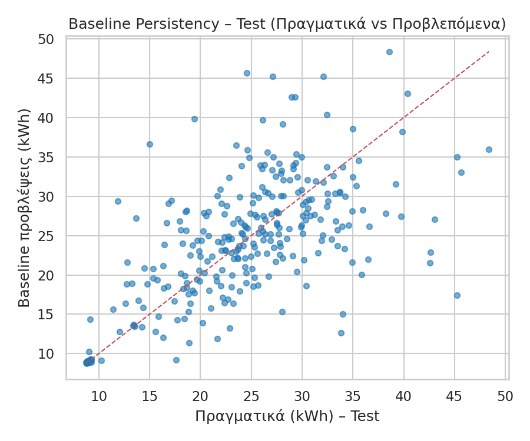

### 9.3 ARIMA(1,1,1)

Το **ARIMA (AutoRegressive Integrated Moving Average)** είναι κλασικό στατιστικό μοντέλο χρονοσειρών. Χρησιμοποιήσαμε ARIMA(1,1,1) (univariate, μόνο με την ίδια τη χρονοσειρά της κατανάλωσης).

**Αποτελέσματα ARIMA:**
- **Validation**: RMSE = 9.31 kWh, MAPE = 42.93%
- **Test**: RMSE = 13.17 kWh, MAPE = 64.84%

Το ARIMA **απέτυχε να ξεπεράσει το baseline**, με σημαντικά χειρότερα αποτελέσματα και στα δύο sets. Αυτό υποδηλώνει ότι η ημερήσια χρονοσειρά δεν έχει ισχυρά γραμμικά αυτοσυσχετιστικά μοτίβα που να μπορεί να αξιοποιήσει το ARIMA.

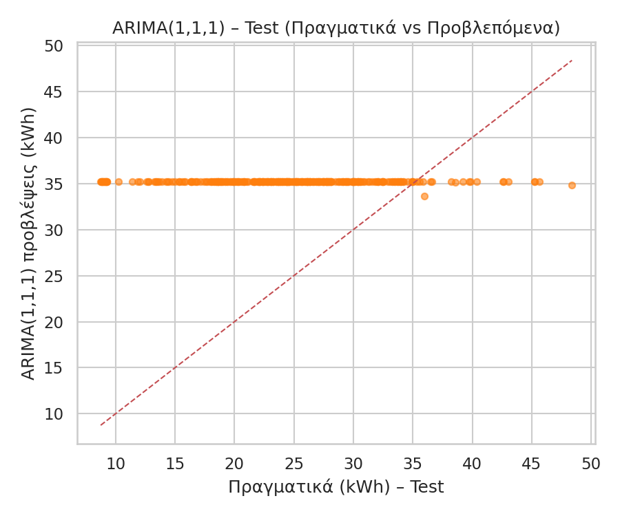

### 9.4 Prophet

Το **Prophet** (από Facebook/Meta) είναι σχεδιασμένο για χρονοσειρές με εποχιακότητες και τάσεις. Χρησιμοποιήσαμε daily και weekly seasonality (χωρίς yearly λόγω περιορισμένου ιστορικού).

**Αποτελέσματα Prophet:**
- **Validation**: RMSE = 16.91 kWh, MAPE = 82.27%
- **Test**: RMSE = 12.43 kWh, MAPE = 59.47%

Το Prophet απέδωσε **ακόμη χειρότερα από το ARIMA στο validation** και ελαφρώς καλύτερα στο test, αλλά και πάλι πολύ χειρότερα από το baseline. Η έλλειψη ισχυρών εποχικών μοτίβων στα ημερήσια δεδομένα εξηγεί την κακή απόδοση.

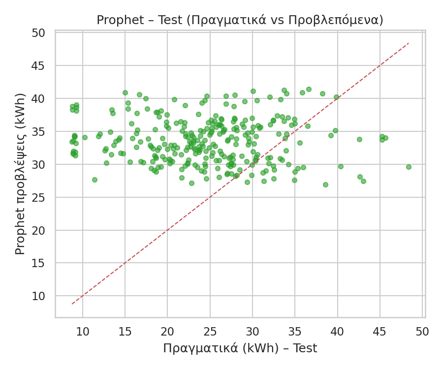

### 9.5 LSTM (Long Short-Term Memory)

Το **LSTM** είναι νευρωνικό δίκτυο ειδικά σχεδιασμένο για χρονοσειρές, με δυνατότητα να "θυμάται" μακροπρόθεσμες εξαρτήσεις. Χρησιμοποιήσαμε:
- **Window size**: 14 ημέρες (τα τελευταία 14 ημέρες για να προβλέψουμε την επόμενη)
- **Scaling**: MinMaxScaler εφαρμοσμένο μόνο στο train (και μετά στο validation/test)
- **Αρχιτεκτονική**: LSTM(64) → Dense(32) → Dense(1)
- **Training**: 50 epochs, batch size 16

**Αποτελέσματα LSTM:**
- **Validation**: RMSE = 5.57 kWh, MAPE = 17.45%
- **Test**: RMSE = 5.61 kWh, MAPE = 17.89%

Το LSTM είναι το **μόνο μοντέλο που ξεπέρασε το baseline**, επιτυγχάνοντας:
- **~18% βελτίωση στο RMSE** σε σχέση με το baseline
- **~12% βελτίωση στο MAPE**

Αυτό δείχνει ότι το νευρωνικό δίκτυο κατάφερε να μάθει πιο πολύπλοκα, μη-γραμμικά μοτίβα από τα παραδοσιακά στατιστικά μοντέλα.

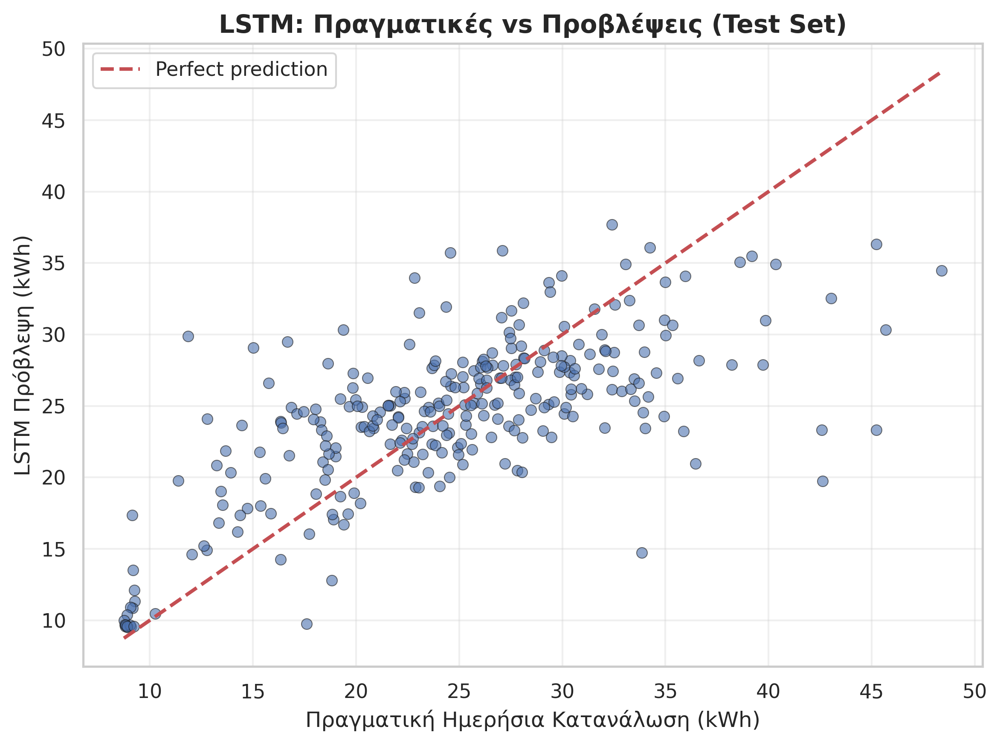

### 9.6 Τελική Σύγκριση Μοντέλων

Ο παρακάτω πίνακας συνοψίζει τις μετρικές όλων των μοντέλων:

| Μοντέλο | Val RMSE (kWh) | Val MAPE (%) | Test RMSE (kWh) | Test MAPE (%) |
|---------|---------------:|-------------:|----------------:|--------------:|
| Baseline (Persistence) | 7.30 | 23.51 | 6.84 | 20.31 |
| ARIMA(1,1,1) | 9.31 | 42.93 | 13.17 | 64.84 |
| Prophet | 16.91 | 82.27 | 12.43 | 59.47 |
| **LSTM** | **5.57** | **17.45** | **5.61** | **17.89** |

Το παρακάτω γράφημα απεικονίζει την απόδοση στο test set, με το καλύτερο μοντέλο (LSTM) να επισημαίνεται με πράσινο χρώμα:

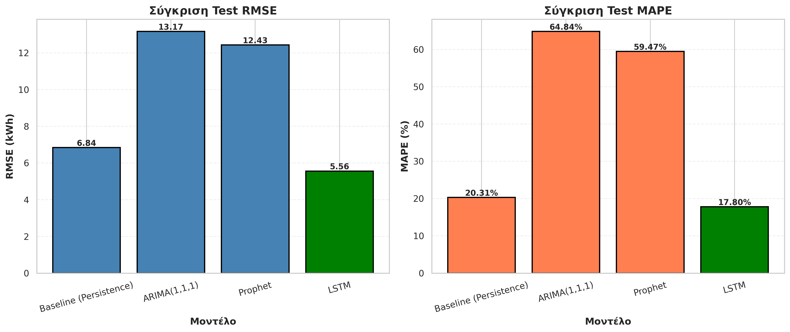

### 9.7 Συμπεράσματα

1. **Το LSTM είναι το καλύτερο μοντέλο** για πρόβλεψη ημερήσιας κατανάλωσης, με σημαντική βελτίωση έναντι του baseline (~18% στο RMSE).

2. **Τα παραδοσιακά μοντέλα (ARIMA, Prophet) απέτυχαν** να ξεπεράσουν το απλό baseline persistence. Αυτό οφείλεται πιθανώς σε:
   - Έλλειψη ισχυρών εποχικών μοτίβων στα ημερήσια δεδομένα
   - Μη-γραμμικότητα στις σχέσεις
   - Περιορισμένο μέγεθος train set για σύνθετα στατιστικά μοντέλα

3. **Το baseline persistence** αποδείχθηκε εκπληκτικά ισχυρό (RMSE ≈ 6.84 kWh), επιβεβαιώνοντας ότι η κατανάλωση έχει μεγάλη αυτοσυσχέτιση μεταξύ διαδοχικών ημερών.

4. **Η μεθοδολογία ήταν αυστηρή**: αποφύγαμε data leakage με χρονικό split και χρήση του test set μόνο μία φορά. Τα αποτελέσματα είναι **ρεαλιστικά** και αντιπροσωπεύουν την πραγματική απόδοση σε άγνωστα δεδομένα.

5. **Πρακτική εφαρμογή**: Το LSTM μπορεί να χρησιμοποιηθεί για ημερήσια πρόβλεψη κατανάλωσης με σφάλμα ~5.6 kWh (περίπου 21% της μέσης ημερήσιας κατανάλωσης), που είναι χρήσιμο για σχεδιασμό και βελτιστοποίηση ενέργειας.

